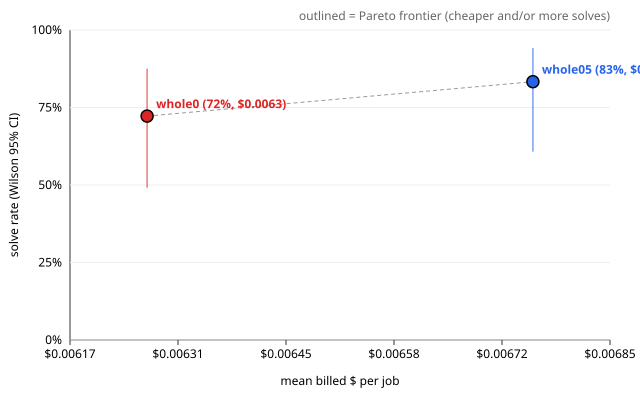

# Evaluation report — ablation4_whole_source ablation4

> **Health: UNKNOWN** — no health.json found; run `scripts/eval_health.py` before believing this run (protocol rule 2).

## Run

- results: `.awos/job_series_ablation4_combined.json`
- run id: `ablation4`
- series: `ablation4_whole_source` · arms: `whole05`, `whole0`
- model pin: `?`
- jobs: 9 · repeats K = 2 · rows: 36
- dropped (paired exclusion): none

## Per arm

Rows valid in every arm only. Intervals are 95%. With K > 1 the runs of one task are correlated, so the run-level intervals are too narrow; use the paired task-level tests below.

| arm | solved/n | rate | Wilson CI | Clopper-Pearson CI | pass@1 | pass^2 | mean turns | mean $/job | $/solved | solved per $1 | mean min |
| --- | --- | --- | --- | --- | --- | --- | --- | --- | --- | --- | --- |
| `whole05` | 15/18 | 83.3% | [60.8, 94.2] | [58.6, 96.4] | 83.3% | 66.7% | 6.9 | $0.0068 | $0.0081 | 123.3 | 1.37 |
| `whole0` | 13/18 | 72.2% | [49.1, 87.5] | [46.5, 90.3] | 72.2% | 55.6% | 10.8 | $0.0063 | $0.0087 | 115.2 | 1.79 |

$ is reconciled provider billing (`billed_usd`).

## Paired comparisons

Each pair uses the jobs valid in both of its arms. Difference = first − second. K > 1: per-task solve-rate difference; paired sign-flip permutation p and bootstrap CI over tasks (seed 20261002, 10000 resamples).
MDE = minimum detectable difference at 80% power (≈ 2.8·sqrt(var(diff)/n), Miller).

### `whole05` vs `whole0` — 9 tasks, 18 paired runs

- solved: whole05 15/18 vs whole0 13/18 · mean difference 11.1% · bootstrap CI [0.0, 27.8]
- paired sign-flip permutation (exact): p = 0.5000
- **Not significant at 0.05.** MDE ≈ 20.6%: a true difference smaller than this would usually go undetected with 9 tasks.
- read these transcripts (discordant tasks): j1, j7
- billed $/job difference: $0.0005 · CI [-0.0042, +0.0053] · sign-flip p = 0.8555 (9 tasks)
- turns difference: -3.8 · CI [-13.8, +4.9] · sign-flip p = 0.5625 (9 tasks)

## Per job

Cell: verdict (✓ solved, ✗ not, invalid) · hidden passed/total · turns · billed $. Repeats are listed in order.

| job | id | `whole05` | `whole0` |
| --- | --- | --- | --- |
| 1 | `real_parse_137` | ✓ 50/50 · 10t · $0.0131 ✓ 50/50 · 1t · $0.0000 | ✗ 49/50 · 54t · $0.0298 ✓ 50/50 · 27t · $0.0038 |
| 2 | `real_parse_159` | ✓ 50/50 · 11t · $0.0053 ✓ 50/50 · 1t · $0.0000 | ✓ 50/50 · 22t · $0.0070 ✓ 50/50 · 13t · $0.0135 |
| 3 | `real_parse_249` | ✓ 50/50 · 1t · $0.0051 ✗ 49/50 · 27t · $0.0280 | ✓ 50/50 · 1t · $0.0053 ✗ 49/50 · 1t · $0.0000 |
| 4 | `real_boltons_458` | ✗ 29/30 · 1t · $0.0000 ✓ 30/30 · 1t · $0.0075 | ✗ 29/30 · 1t · $0.0000 ✓ 30/30 · 31t · $0.0175 |
| 5 | `real_boltons_474` | ✓ 16/16 · 1t · $0.0000 ✓ 16/16 · 1t · $0.0000 | ✓ 16/16 · 1t · $0.0000 ✓ 16/16 · 1t · $0.0042 |
| 6 | `real_tomlkit_591` | ✓ 73/73 · 32t · $0.0176 ✓ 73/73 · 20t · $0.0170 | ✓ 73/73 · 20t · $0.0074 ✓ 73/73 · 1t · $0.0152 |
| 7 | `real_toolz_635` | ✓ 51/51 · 1t · $0.0000 ✗ 50/51 · 1t · $0.0116 | ✗ 50/51 · 1t · $0.0000 ✗ 50/51 · 1t · $0.0000 |
| 8 | `real_boltons_428` | ✓ 45/45 · 1t · $0.0114 ✓ 45/45 · 13t · $0.0038 | ✓ 45/45 · 1t · $0.0000 ✓ 45/45 · 16t · $0.0057 |
| 9 | `real_jsonpointer_64` | ✓ 26/26 · 1t · $0.0000 ✓ 26/26 · 1t · $0.0010 | ✓ 26/26 · 1t · $0.0025 ✓ 26/26 · 1t · $0.0010 |

\* ledger cost (no reconciled billing for that row).

## Failures (valid rows)

Includes valid rows of jobs dropped by paired exclusion.

### `whole05` — 3 unsolved valid run(s)

- j3 r2 `real_parse_249`: `tests/test_hidden_parse.py::test_numbers`
- j4 r1 `real_boltons_458`: `tests/test_hidden_dictutils.py::test_addlist_iterator`
- j7 r2 `real_toolz_635`: `tests/test_hidden_itertoolz.py::test_interpose_empty`

### `whole0` — 5 unsolved valid run(s)

- j1 r1 `real_parse_137`: `tests/test_hidden_parse.py::test_numbers`
- j3 r2 `real_parse_249`: `tests/test_hidden_parse.py::test_numbers`
- j4 r1 `real_boltons_458`: `tests/test_hidden_dictutils.py::test_addlist_iterator`
- j7 r1 `real_toolz_635`: `tests/test_hidden_itertoolz.py::test_interpose_empty`
- j7 r2 `real_toolz_635`: `tests/test_hidden_itertoolz.py::test_interpose_empty`

### Failing hidden tests across arms

| test | `whole05` | `whole0` | total |
| --- | --- | --- | --- |
| `tests/test_hidden_itertoolz.py::test_interpose_empty` | 1 | 2 | 3 |
| `tests/test_hidden_parse.py::test_numbers` | 1 | 2 | 3 |
| `tests/test_hidden_dictutils.py::test_addlist_iterator` | 1 | 1 | 2 |

## Pareto: solve rate vs $

| arm | mean $/job | solve rate |
| --- | --- | --- |
| `whole05` | $0.0068 | 83.3% |
| `whole0` | $0.0063 | 72.2% |

Protocol rule 9: compare against a simple retry baseline at the same budget before claiming a cost win.
