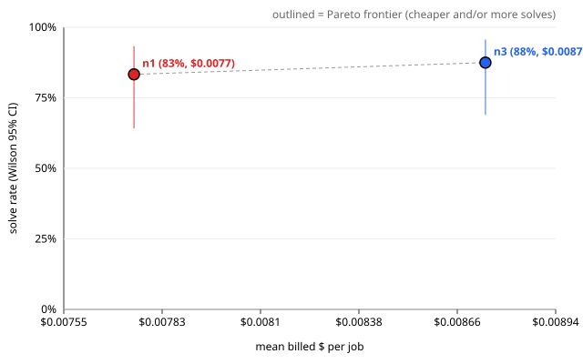

# Evaluation report — ablationA_best_of_n ablationA

> **Health: UNKNOWN** — no health.json found; run `scripts/eval_health.py` before believing this run (protocol rule 2).

## Run

- results: `.awos/job_series_ablationA_combined.json`
- run id: `ablationA`
- series: `ablationA_best_of_n` · arms: `n3`, `n1`
- model pin: `?`
- jobs: 12 · repeats K = 2 · rows: 48
- dropped (paired exclusion): none

## Per arm

Rows valid in every arm only. Intervals are 95%. With K > 1 the runs of one task are correlated, so the run-level intervals are too narrow; use the paired task-level tests below.

| arm | solved/n | rate | Wilson CI | Clopper-Pearson CI | pass@1 | pass^2 | mean turns | mean $/job | $/solved | solved per $1 | mean min |
| --- | --- | --- | --- | --- | --- | --- | --- | --- | --- | --- | --- |
| `n3` | 21/24 | 87.5% | [69.0, 95.7] | [67.6, 97.3] | 87.5% | 83.3% | 7.0 | $0.0087 | $0.0100 | 100.1 | 2.40 |
| `n1` | 20/24 | 83.3% | [64.1, 93.3] | [62.6, 95.3] | 83.3% | 75.0% | 11.6 | $0.0077 | $0.0093 | 107.6 | 2.68 |

$ is reconciled provider billing (`billed_usd`).

## Paired comparisons

Each pair uses the jobs valid in both of its arms. Difference = first − second. K > 1: per-task solve-rate difference; paired sign-flip permutation p and bootstrap CI over tasks (seed 20261002, 10000 resamples).
MDE = minimum detectable difference at 80% power (≈ 2.8·sqrt(var(diff)/n), Miller).

### `n3` vs `n1` — 12 tasks, 24 paired runs

- solved: n3 21/24 vs n1 20/24 · mean difference 4.2% · bootstrap CI [0.0, 12.5]
- paired sign-flip permutation (exact): p = 1.0000
- **Not significant at 0.05.** MDE ≈ 11.7%: a true difference smaller than this would usually go undetected with 12 tasks.
- read these transcripts (discordant tasks): j1
- billed $/job difference: $0.0010 · CI [-0.0038, +0.0049] · sign-flip p = 0.6880 (12 tasks)
- turns difference: -4.5 · CI [-9.8, -0.5] · sign-flip p = 0.0547 (12 tasks)

## Per job

Cell: verdict (✓ solved, ✗ not, invalid) · hidden passed/total · turns · billed $. Repeats are listed in order.

| job | id | `n3` | `n1` |
| --- | --- | --- | --- |
| 1 | `real_cachetools_405` | ✓ 175/175 · 28t · $0.0335 ✓ 175/175 · 26t · $0.0230 | ✓ 175/175 · 30t · $0.0131 ✗ 169/175 · 82t · $0.0837 |
| 2 | `real_parse_137` | ✓ 50/50 · 11t · $0.0068 ✓ 50/50 · 1t · $0.0050 | ✓ 50/50 · 21t · $0.0144 ✓ 50/50 · 1t · $0.0000 |
| 3 | `real_boltons_458` | ✓ 30/30 · 1t · $0.0051 ✓ 30/30 · 10t · $0.0096 | ✓ 30/30 · 9t · $0.0000 ✓ 30/30 · 8t · $0.0110 |
| 4 | `real_tabulate_176` | ✓ 178/178 · 12t · $0.0063 ✓ 178/178 · 2t · $0.0095 | ✓ 178/178 · 14t · $0.0079 ✓ 178/178 · 21t · $0.0046 |
| 5 | `real_toolz_634` | ✗ 38/39 · 1t · $0.0035 ✗ 38/39 · 2t · $0.0000 | ✗ 38/39 · 12t · $0.0112 ✗ 38/39 · 1t · $0.0000 |
| 6 | `real_pyparsing_647` | ✓ 1850/1850 · 1t · $0.0064 ✓ 1850/1850 · 12t · $0.0100 | ✓ 1850/1850 · 13t · $0.0091 ✓ 1850/1850 · 1t · $0.0036 |
| 7 | `real_sqlparse_332` | ✗ 87/88 · 28t · $0.0283 ✓ 88/88 · 1t · $0.0104 | ✗ 87/88 · 27t · $0.0170 ✓ 88/88 · 13t · $0.0036 |
| 8 | `real_more-itertools_1304` | ✓ 619/619 · 8t · $0.0000 ✓ 619/619 · 1t · $0.0076 | ✓ 619/619 · 8t · $0.0000 ✓ 619/619 · 9t · $0.0035 |
| 9 | `real_boltons_474` | ✓ 16/16 · 1t · $0.0049 ✓ 16/16 · 1t · $0.0090 | ✓ 16/16 · 1t · $0.0000 ✓ 16/16 · 1t · $0.0000 |
| 10 | `real_jsonpointer_64` | ✓ 26/26 · 1t · $0.0047 ✓ 26/26 · 1t · $0.0000 | ✓ 26/26 · 1t · $0.0000 ✓ 26/26 · 1t · $0.0000 |
| 11 | `real_tabulate_256` | ✓ 178/178 · 1t · $0.0000 ✓ 178/178 · 7t · $0.0000 | ✓ 178/178 · 1t · $0.0032 ✓ 178/178 · 1t · $0.0000 |
| 12 | `real_sqlparse_867` | ✓ 100/100 · 1t · $0.0054 ✓ 100/100 · 11t · $0.0207 | ✓ 100/100 · 1t · $0.0000 ✓ 100/100 · 1t · $0.0000 |

\* ledger cost (no reconciled billing for that row).

## Failures (valid rows)

Includes valid rows of jobs dropped by paired exclusion.

### `n3` — 3 unsolved valid run(s)

- j5 r1 `real_toolz_634`: `tests/test_hidden_functoolz.py::test_compose_annotations`
- j5 r2 `real_toolz_634`: `tests/test_hidden_functoolz.py::test_compose_annotations`
- j7 r1 `real_sqlparse_332`: `tests/test_hidden_parse.py::test_get_real_name_multi_part_dotted`

### `n1` — 4 unsolved valid run(s)

- j1 r2 `real_cachetools_405`: `tests/test_hidden_cache.py::CacheTest::test_getsizeof_replace_grow`, `tests/test_hidden_fifo.py::FIFOCacheTest::test_getsizeof_replace_grow`, `tests/test_hidden_lfu.py::LFUCacheTest::test_getsizeof_replace_grow`, `tests/test_hidden_lru.py::LRUCacheTest::test_getsizeof_replace_grow`, `tests/test_hidden_tlru.py::TLRUCacheTest::test_getsizeof_replace_grow`, `tests/test_hidden_ttl.py::TTLCacheTest::test_getsizeof_replace_grow`
- j5 r1 `real_toolz_634`: `tests/test_hidden_functoolz.py::test_compose_annotations`
- j5 r2 `real_toolz_634`: `tests/test_hidden_functoolz.py::test_compose_annotations`
- j7 r1 `real_sqlparse_332`: `tests/test_hidden_parse.py::test_get_real_name_multi_part_dotted`

### Failing hidden tests across arms

| test | `n3` | `n1` | total |
| --- | --- | --- | --- |
| `tests/test_hidden_functoolz.py::test_compose_annotations` | 2 | 2 | 4 |
| `tests/test_hidden_parse.py::test_get_real_name_multi_part_dotted` | 1 | 1 | 2 |
| `tests/test_hidden_cache.py::CacheTest::test_getsizeof_replace_grow` | 0 | 1 | 1 |
| `tests/test_hidden_fifo.py::FIFOCacheTest::test_getsizeof_replace_grow` | 0 | 1 | 1 |
| `tests/test_hidden_lfu.py::LFUCacheTest::test_getsizeof_replace_grow` | 0 | 1 | 1 |
| `tests/test_hidden_lru.py::LRUCacheTest::test_getsizeof_replace_grow` | 0 | 1 | 1 |
| `tests/test_hidden_tlru.py::TLRUCacheTest::test_getsizeof_replace_grow` | 0 | 1 | 1 |
| `tests/test_hidden_ttl.py::TTLCacheTest::test_getsizeof_replace_grow` | 0 | 1 | 1 |

## Pareto: solve rate vs $

| arm | mean $/job | solve rate |
| --- | --- | --- |
| `n3` | $0.0087 | 87.5% |
| `n1` | $0.0077 | 83.3% |

Protocol rule 9: compare against a simple retry baseline at the same budget before claiming a cost win.
