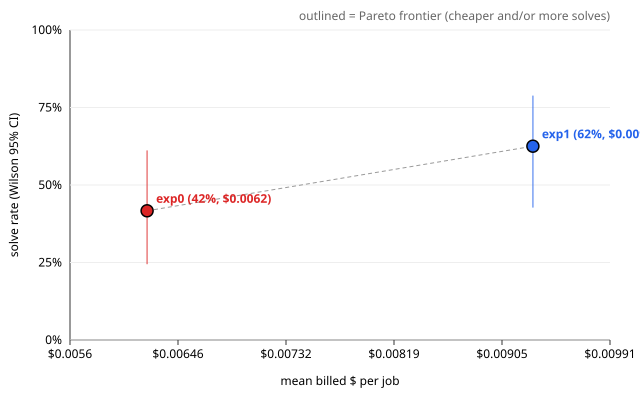

# Evaluation report — ablationB_experience ablationB

> **Health: UNKNOWN** — no health.json found; run `scripts/eval_health.py` before believing this run (protocol rule 2).

## Run

- results: `.awos/job_series_ablationB_combined.json`
- run id: `ablationB`
- series: `ablationB_experience` · arms: `exp1`, `exp0`
- model pin: `?`
- jobs: 12 · repeats K = 2 · rows: 48
- dropped (paired exclusion): none

## Per arm

Rows valid in every arm only. Intervals are 95%. With K > 1 the runs of one task are correlated, so the run-level intervals are too narrow; use the paired task-level tests below.

| arm | solved/n | rate | Wilson CI | Clopper-Pearson CI | pass@1 | pass^2 | mean turns | mean $/job | $/solved | solved per $1 | mean min |
| --- | --- | --- | --- | --- | --- | --- | --- | --- | --- | --- | --- |
| `exp1` | 15/24 | 62.5% | [42.7, 78.8] | [40.6, 81.2] | 62.5% | 50.0% | 13.7 | $0.0093 | $0.0149 | 67.2 | 2.40 |
| `exp0` | 10/24 | 41.7% | [24.5, 61.2] | [22.1, 63.4] | 41.7% | 33.3% | 10.7 | $0.0062 | $0.0149 | 67.0 | 2.49 |

$ is reconciled provider billing (`billed_usd`).

## Paired comparisons

Each pair uses the jobs valid in both of its arms. Difference = first − second. K > 1: per-task solve-rate difference; paired sign-flip permutation p and bootstrap CI over tasks (seed 20261002, 10000 resamples).
MDE = minimum detectable difference at 80% power (≈ 2.8·sqrt(var(diff)/n), Miller).

### `exp1` vs `exp0` — 12 tasks, 24 paired runs

- solved: exp1 15/24 vs exp0 10/24 · mean difference 20.8% · bootstrap CI [-8.3, 45.8]
- paired sign-flip permutation (exact): p = 0.2812
- **Not significant at 0.05.** MDE ≈ 40.3%: a true difference smaller than this would usually go undetected with 12 tasks.
- read these transcripts (discordant tasks): j2, j4, j5, j7, j9, j11, j12
- billed $/job difference: $0.0031 · CI [-0.0019, +0.0086] · sign-flip p = 0.3184 (12 tasks)
- turns difference: 3.0 · CI [-4.3, +10.5] · sign-flip p = 0.4883 (12 tasks)

## Per job

Cell: verdict (✓ solved, ✗ not, invalid) · hidden passed/total · turns · billed $. Repeats are listed in order.

| job | id | `exp1` | `exp0` |
| --- | --- | --- | --- |
| 1 | `01_missing_source_error` | ✓ 7/7 · 1t · $0.0000 ✓ 7/7 · 1t · $0.0133 | ✓ 7/7 · 1t · $0.0000 ✓ 7/7 · 1t · $0.0006 |
| 2 | `02_list_backups` | ✓ 8/8 · 1t · $0.0086 ✓ 8/8 · 1t · $0.0070 | ✗ 0/8 · 1t · $0.0016 ✓ 8/8 · 11t · $0.0016 |
| 3 | `03_cli_handlers_refactor` | ✓ 14/14 · 1t · $0.0000 ✓ 14/14 · 1t · $0.0024 | ✓ 14/14 · 1t · $0.0000 ✓ 14/14 · 1t · $0.0045 |
| 4 | `04_min_free_space` | ✓ 12/12 · 2t · $0.0000 ✓ 12/12 · 2t · $0.0086 | ✗ 10/12 · 2t · $0.0054 ✓ 12/12 · 2t · $0.0155 |
| 5 | `05_partial_archive_bug` | ✓ 6/6 · 26t · $0.0080 ✓ 6/6 · 15t · $0.0028 | ✗ 2/6 · 1t · $0.0000 ✗ 2/6 · 1t · $0.0000 |
| 6 | `06_status_report` | ✗ 3/7 · 18t · $0.0195 ✗ 2/7 · 2t · $0.0000 | ✗ 3/7 · 21t · $0.0031 ✗ 2/7 · 2t · $0.0015 |
| 7 | `07_verify_command` | ✗ 9/10 · 42t · $0.0313 ✓ 10/10 · 25t · $0.0037 | ✗ 9/10 · 29t · $0.0109 ✗ 9/10 · 11t · $0.0062 |
| 8 | `08_exclude_dir_patterns` | ✓ 6/6 · 11t · $0.0000 ✓ 6/6 · 2t · $0.0000 | ✓ 6/6 · 2t · $0.0000 ✓ 6/6 · 1t · $0.0000 |
| 9 | `09_failure_notifications` | ✗ 13/14 · 22t · $0.0306 ✓ 14/14 · 70t · $0.0253 | ✗ 13/14 · 18t · $0.0039 ✗ 13/14 · 11t · $0.0000 |
| 10 | `10_keep_last` | ✗ 9/10 · 10t · $0.0000 ✗ 9/10 · 13t · $0.0040 | ✗ 9/10 · 2t · $0.0000 ✗ 9/10 · 31t · $0.0258 |
| 11 | `11_restore_command` | ✓ 12/12 · 19t · $0.0226 ✗ 9/12 · 41t · $0.0085 | ✗ 8/12 · 27t · $0.0366 ✗ 9/12 · 30t · $0.0124 |
| 12 | `12_prune_command` | ✗ 6/9 · 1t · $0.0000 ✗ 6/9 · 1t · $0.0269 | ✓ 9/9 · 39t · $0.0194 ✓ 9/9 · 11t · $0.0000 |

\* ledger cost (no reconciled billing for that row).

## Failures (valid rows)

Includes valid rows of jobs dropped by paired exclusion.

### `exp1` — 9 unsolved valid run(s)

- j6 r1 `06_status_report`: `tests/test_hidden_j06_status.py::test_report_dict`, `tests/test_hidden_j06_status.py::test_json_view`, `tests/test_hidden_j06_status.py::test_json_env_wins_over_ini`, `tests/test_hidden_j06_status.py::test_no_backups`
- j6 r2 `06_status_report`: `tests/test_hidden_j06_status.py::test_report_dict`, `tests/test_hidden_j06_status.py::test_text_layout`, `tests/test_hidden_j06_status.py::test_json_view`, `tests/test_hidden_j06_status.py::test_json_env_wins_over_ini`, `tests/test_hidden_j06_status.py::test_no_backups`
- j7 r1 `07_verify_command`: `tests/test_hidden_j07_verify.py::test_unknown_name`
- j9 r1 `09_failure_notifications`: `tests/test_hidden_j09_notify_on.py::test_unreachable_mail_server_does_not_hide_the_error`
- j10 r1 `10_keep_last`: `tests/test_hidden_j10_keep_last.py::test_bad_values_are_config_errors[-1]`
- j10 r2 `10_keep_last`: `tests/test_hidden_j10_keep_last.py::test_bad_values_are_config_errors[-1]`
- j11 r2 `11_restore_command`: `tests/test_hidden_j11_restore.py::test_unsafe_archives_extract_nothing[make_zip-backup-20200313-000000.zip-members0]`, `tests/test_hidden_j11_restore.py::test_unsafe_archives_extract_nothing[make_tar-backup-20200313-000000.tar-members1]`, `tests/test_hidden_j11_restore.py::test_unsafe_archives_extract_nothing[make_tar-backup-20200313-000000.tar-members2]`
- j12 r1 `12_prune_command`: `tests/test_hidden_j12_prune.py::test_prune`, `tests/test_hidden_j12_prune.py::test_keep_last_from_ini`, `tests/test_hidden_j12_prune.py::test_pruning_is_logged`
- j12 r2 `12_prune_command`: `tests/test_hidden_j12_prune.py::test_prune`, `tests/test_hidden_j12_prune.py::test_keep_last_from_ini`, `tests/test_hidden_j12_prune.py::test_pruning_is_logged`

### `exp0` — 14 unsolved valid run(s)

- j2 r1 `02_list_backups`: `tests/test_hidden_j02_list.py::test_list_layout_with_ini`, `tests/test_hidden_j02_list.py::test_list_needs_only_backup_dir_from_env`, `tests/test_hidden_j02_list.py::test_env_backup_dir_wins_over_ini`, `tests/test_hidden_j02_list.py::test_explicit_config_path`, `tests/test_hidden_j02_list.py::test_single_backup_wording`, `tests/test_hidden_j02_list.py::test_no_backups[True]`, `tests/test_hidden_j02_list.py::test_no_backups[False]`, `tests/test_hidden_j02_list.py::test_missing_backup_dir_setting`
- j4 r1 `04_min_free_space`: `tests/test_hidden_j04_min_free_space.py::test_not_enough_space_refuses_the_run`, `tests/test_hidden_j04_min_free_space.py::test_env_can_raise_the_limit`
- j5 r1 `05_partial_archive_bug`: `tests/test_hidden_j05_partial_archive.py::test_failed_write_leaves_nothing_behind[true-ZipFile-write]`, `tests/test_hidden_j05_partial_archive.py::test_failed_write_leaves_nothing_behind[false-TarFile-add]`, `tests/test_hidden_j05_partial_archive.py::test_monitoring_still_sees_the_previous_backup`, `tests/test_hidden_j05_partial_archive.py::test_run_backup_raises_project_error`
- j5 r2 `05_partial_archive_bug`: `tests/test_hidden_j05_partial_archive.py::test_failed_write_leaves_nothing_behind[true-ZipFile-write]`, `tests/test_hidden_j05_partial_archive.py::test_failed_write_leaves_nothing_behind[false-TarFile-add]`, `tests/test_hidden_j05_partial_archive.py::test_monitoring_still_sees_the_previous_backup`, `tests/test_hidden_j05_partial_archive.py::test_run_backup_raises_project_error`
- j6 r1 `06_status_report`: `tests/test_hidden_j06_status.py::test_report_dict`, `tests/test_hidden_j06_status.py::test_json_view`, `tests/test_hidden_j06_status.py::test_json_env_wins_over_ini`, `tests/test_hidden_j06_status.py::test_no_backups`
- j6 r2 `06_status_report`: `tests/test_hidden_j06_status.py::test_report_dict`, `tests/test_hidden_j06_status.py::test_text_layout`, `tests/test_hidden_j06_status.py::test_json_view`, `tests/test_hidden_j06_status.py::test_json_env_wins_over_ini`, `tests/test_hidden_j06_status.py::test_no_backups`
- j7 r1 `07_verify_command`: `tests/test_hidden_j07_verify.py::test_unknown_name`
- j7 r2 `07_verify_command`: `tests/test_hidden_j07_verify.py::test_unknown_name`
- j9 r1 `09_failure_notifications`: `tests/test_hidden_j09_notify_on.py::test_unreachable_mail_server_does_not_hide_the_error`
- j9 r2 `09_failure_notifications`: `tests/test_hidden_j09_notify_on.py::test_unreachable_mail_server_does_not_hide_the_error`
- j10 r1 `10_keep_last`: `tests/test_hidden_j10_keep_last.py::test_bad_values_are_config_errors[-1]`
- j10 r2 `10_keep_last`: `tests/test_hidden_j10_keep_last.py::test_bad_values_are_config_errors[-1]`
- j11 r1 `11_restore_command`: `tests/test_hidden_j11_restore.py::test_refuses_file_as_destination`, `tests/test_hidden_j11_restore.py::test_unsafe_archives_extract_nothing[make_zip-backup-20200313-000000.zip-members0]`, `tests/test_hidden_j11_restore.py::test_unsafe_archives_extract_nothing[make_tar-backup-20200313-000000.tar-members1]`, `tests/test_hidden_j11_restore.py::test_unsafe_archives_extract_nothing[make_tar-backup-20200313-000000.tar-members2]`
- j11 r2 `11_restore_command`: `tests/test_hidden_j11_restore.py::test_unsafe_archives_extract_nothing[make_zip-backup-20200313-000000.zip-members0]`, `tests/test_hidden_j11_restore.py::test_unsafe_archives_extract_nothing[make_tar-backup-20200313-000000.tar-members1]`, `tests/test_hidden_j11_restore.py::test_unsafe_archives_extract_nothing[make_tar-backup-20200313-000000.tar-members2]`

### Failing hidden tests across arms

| test | `exp1` | `exp0` | total |
| --- | --- | --- | --- |
| `tests/test_hidden_j06_status.py::test_json_env_wins_over_ini` | 2 | 2 | 4 |
| `tests/test_hidden_j06_status.py::test_json_view` | 2 | 2 | 4 |
| `tests/test_hidden_j06_status.py::test_no_backups` | 2 | 2 | 4 |
| `tests/test_hidden_j06_status.py::test_report_dict` | 2 | 2 | 4 |
| `tests/test_hidden_j10_keep_last.py::test_bad_values_are_config_errors[-1]` | 2 | 2 | 4 |
| `tests/test_hidden_j07_verify.py::test_unknown_name` | 1 | 2 | 3 |
| `tests/test_hidden_j09_notify_on.py::test_unreachable_mail_server_does_not_hide_the_error` | 1 | 2 | 3 |
| `tests/test_hidden_j11_restore.py::test_unsafe_archives_extract_nothing[make_tar-backup-20200313-000000.tar-members1]` | 1 | 2 | 3 |
| `tests/test_hidden_j11_restore.py::test_unsafe_archives_extract_nothing[make_tar-backup-20200313-000000.tar-members2]` | 1 | 2 | 3 |
| `tests/test_hidden_j11_restore.py::test_unsafe_archives_extract_nothing[make_zip-backup-20200313-000000.zip-members0]` | 1 | 2 | 3 |
| `tests/test_hidden_j05_partial_archive.py::test_failed_write_leaves_nothing_behind[false-TarFile-add]` | 0 | 2 | 2 |
| `tests/test_hidden_j05_partial_archive.py::test_failed_write_leaves_nothing_behind[true-ZipFile-write]` | 0 | 2 | 2 |
| `tests/test_hidden_j05_partial_archive.py::test_monitoring_still_sees_the_previous_backup` | 0 | 2 | 2 |
| `tests/test_hidden_j05_partial_archive.py::test_run_backup_raises_project_error` | 0 | 2 | 2 |
| `tests/test_hidden_j06_status.py::test_text_layout` | 1 | 1 | 2 |
| `tests/test_hidden_j12_prune.py::test_keep_last_from_ini` | 2 | 0 | 2 |
| `tests/test_hidden_j12_prune.py::test_prune` | 2 | 0 | 2 |
| `tests/test_hidden_j12_prune.py::test_pruning_is_logged` | 2 | 0 | 2 |
| `tests/test_hidden_j02_list.py::test_env_backup_dir_wins_over_ini` | 0 | 1 | 1 |
| `tests/test_hidden_j02_list.py::test_explicit_config_path` | 0 | 1 | 1 |
| `tests/test_hidden_j02_list.py::test_list_layout_with_ini` | 0 | 1 | 1 |
| `tests/test_hidden_j02_list.py::test_list_needs_only_backup_dir_from_env` | 0 | 1 | 1 |
| `tests/test_hidden_j02_list.py::test_missing_backup_dir_setting` | 0 | 1 | 1 |
| `tests/test_hidden_j02_list.py::test_no_backups[False]` | 0 | 1 | 1 |
| `tests/test_hidden_j02_list.py::test_no_backups[True]` | 0 | 1 | 1 |
| `tests/test_hidden_j02_list.py::test_single_backup_wording` | 0 | 1 | 1 |
| `tests/test_hidden_j04_min_free_space.py::test_env_can_raise_the_limit` | 0 | 1 | 1 |
| `tests/test_hidden_j04_min_free_space.py::test_not_enough_space_refuses_the_run` | 0 | 1 | 1 |
| `tests/test_hidden_j11_restore.py::test_refuses_file_as_destination` | 0 | 1 | 1 |

## Pareto: solve rate vs $

| arm | mean $/job | solve rate |
| --- | --- | --- |
| `exp1` | $0.0093 | 62.5% |
| `exp0` | $0.0062 | 41.7% |

Protocol rule 9: compare against a simple retry baseline at the same budget before claiming a cost win.
