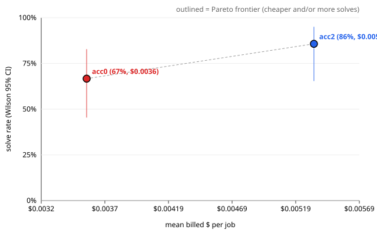

# Evaluation report — ablationC2_acceptance ablationC2

> **Health: UNKNOWN** — no health.json found; run `scripts/eval_health.py` before believing this run (protocol rule 2).

## Run

- results: `.awos/job_series_ablationC2_combined.json`
- run id: `ablationC2`
- series: `ablationC2_acceptance` · arms: `acc2`, `acc0`
- model pin: `?`
- jobs: 11 · repeats K = 2 · rows: 45
- dropped from all arms (paired exclusion, 1):
  - r1:j3 — acc2: log shows 'AuthenticationError'

## Per arm

Rows valid in every arm only. Intervals are 95%. With K > 1 the runs of one task are correlated, so the run-level intervals are too narrow; use the paired task-level tests below.

| arm | solved/n | rate | Wilson CI | Clopper-Pearson CI | pass@1 | pass^2 | mean turns | mean $/job | $/solved | solved per $1 | mean min |
| --- | --- | --- | --- | --- | --- | --- | --- | --- | --- | --- | --- |
| `acc2` | 18/21 | 85.7% | [65.4, 95.0] | [63.7, 97.0] | 86.4% | 80.0% | 8.1 | $0.0053 | $0.0062 | 160.7 | 1.43 |
| `acc0` | 14/21 | 66.7% | [45.4, 82.8] | [43.0, 85.4] | 63.6% | 60.0% | 7.4 | $0.0036 | $0.0053 | 187.6 | 1.39 |

Before paired exclusion (each arm on its own valid rows, not comparable across arms): `acc2` 18/22 (81.8%, Wilson [61.5, 92.7]) · `acc0` 15/22 (68.2%, Wilson [47.3, 83.6]).

$ is reconciled provider billing (`billed_usd`).

## Paired comparisons

Each pair uses the jobs valid in both of its arms. Difference = first − second. K > 1: per-task solve-rate difference; paired sign-flip permutation p and bootstrap CI over tasks (seed 20261002, 10000 resamples).
MDE = minimum detectable difference at 80% power (≈ 2.8·sqrt(var(diff)/n), Miller).

### `acc2` vs `acc0` — 11 tasks, 21 paired runs

- excluded: jr1:3 (acc2: log shows 'AuthenticationError')
- solved: acc2 18/21 vs acc0 14/21 · mean difference 22.7% · bootstrap CI [0.0, 50.0]
- paired sign-flip permutation (exact): p = 0.2500
- **Not significant at 0.05.** MDE ≈ 34.6%: a true difference smaller than this would usually go undetected with 11 tasks.
- read these transcripts (discordant tasks): j1, j4, j6, j3
- billed $/job difference: $0.0020 · CI [-0.0002, +0.0040] · sign-flip p = 0.1006 (11 tasks)
- turns difference: 1.1 · CI [-1.9, +4.1] · sign-flip p = 0.4688 (11 tasks)

## Per job

Cell: verdict (✓ solved, ✗ not, invalid) · hidden passed/total · turns · billed $. Repeats are listed in order.

| job | id | `acc2` | `acc0` |
| --- | --- | --- | --- |
| 1 | `real_more-itertools_1304` | ✓ 619/619 · 9t · $0.0045 ✓ 619/619 · 1t · $0.0020 | ✗ 618/619 · 1t · $0.0000 ✗ 618/619 · 1t · $0.0000 |
| 2 | `real_parse_249` | ✓ 50/50 · 1t · $0.0000 ✓ 50/50 · 23t · $0.0102 | ✓ 50/50 · 2t · $0.0024 ✓ 50/50 · 29t · $0.0030 |
| 3 | `real_pyparsing_647` | ✗ 1850/1856 · 1t · $0.0000 ✓ 1850/1850 · 11t · $0.0099 | ✓ 1850/1850 · 51t · $0.0452 ✗ 1850/1856 · 1t · $0.0028 |
| 4 | `real_tabulate_176` | ✓ 178/178 · 21t · $0.0061 ✓ 178/178 · 24t · $0.0041 | ✗ 177/178 · 28t · $0.0040 ✓ 178/178 · 16t · $0.0149 |
| 5 | `real_toolz_634` | ✗ 38/39 · 19t · $0.0175 ✗ 38/39 · 27t · $0.0124 | ✗ 38/39 · 38t · $0.0259 ✗ 38/39 · 27t · $0.0120 |
| 6 | `real_toolz_635` | ✓ 51/51 · 8t · $0.0092 ✗ 50/51 · 1t · $0.0000 | ✗ 50/51 · 1t · $0.0000 ✓ 51/51 · 1t · $0.0000 |
| 7 | `real_boltons_458` | ✓ 30/30 · 10t · $0.0058 ✓ 30/30 · 7t · $0.0059 | ✓ 30/30 · 1t · $0.0032 ✓ 30/30 · 1t · $0.0000 |
| 8 | `real_boltons_474` | ✓ 16/16 · 1t · $0.0088 ✓ 16/16 · 1t · $0.0000 | ✓ 16/16 · 1t · $0.0000 ✓ 16/16 · 1t · $0.0000 |
| 9 | `real_tabulate_256` | ✓ 178/178 · 1t · $0.0000 ✓ 178/178 · 1t · $0.0038 | ✓ 178/178 · 1t · $0.0060 ✓ 178/178 · 1t · $0.0000 |
| 10 | `real_jsonpointer_64` | ✓ 26/26 · 1t · $0.0000 ✓ 26/26 · 1t · $0.0023 | ✓ 26/26 · 1t · $0.0000 ✓ 26/26 · 1t · $0.0000 |
| 11 | `real_sqlparse_867` | ✓ 100/100 · 1t · $0.0056 ✓ 100/100 · 1t · $0.0038 | ✓ 100/100 · 1t · $0.0004 ✓ 100/100 · 1t · $0.0000 |

\* ledger cost (no reconciled billing for that row).

## Failures (valid rows)

Includes valid rows of jobs dropped by paired exclusion.

### `acc2` — 4 unsolved valid run(s)

- j3 r1 `real_pyparsing_647`: (no hidden test failed; visible failing: -)
- j5 r1 `real_toolz_634`: `tests/test_hidden_functoolz.py::test_compose_annotations`
- j5 r2 `real_toolz_634`: `tests/test_hidden_functoolz.py::test_compose_annotations`
- j6 r2 `real_toolz_635`: `tests/test_hidden_itertoolz.py::test_interpose_empty`

### `acc0` — 7 unsolved valid run(s)

- j1 r1 `real_more-itertools_1304`: `tests/test_hidden_more.py::IchunkedTests::test_zero_nonempty`
- j1 r2 `real_more-itertools_1304`: `tests/test_hidden_more.py::IchunkedTests::test_zero_nonempty`
- j3 r2 `real_pyparsing_647`: (no hidden test failed; visible failing: -)
- j4 r1 `real_tabulate_176`: `tests/test_hidden_output.py::test_floatfmt_decimal`
- j5 r1 `real_toolz_634`: `tests/test_hidden_functoolz.py::test_compose_annotations`
- j5 r2 `real_toolz_634`: `tests/test_hidden_functoolz.py::test_compose_annotations`
- j6 r1 `real_toolz_635`: `tests/test_hidden_itertoolz.py::test_interpose_empty`

### Failing hidden tests across arms

| test | `acc2` | `acc0` | total |
| --- | --- | --- | --- |
| `tests/test_hidden_functoolz.py::test_compose_annotations` | 2 | 2 | 4 |
| `tests/test_hidden_itertoolz.py::test_interpose_empty` | 1 | 1 | 2 |
| `tests/test_hidden_more.py::IchunkedTests::test_zero_nonempty` | 0 | 2 | 2 |
| `tests/test_hidden_output.py::test_floatfmt_decimal` | 0 | 1 | 1 |

## Pareto: solve rate vs $

| arm | mean $/job | solve rate |
| --- | --- | --- |
| `acc2` | $0.0053 | 85.7% |
| `acc0` | $0.0036 | 66.7% |

Protocol rule 9: compare against a simple retry baseline at the same budget before claiming a cost win.
