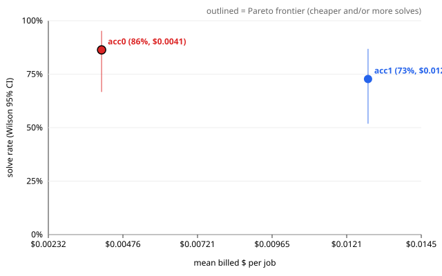

# Evaluation report — ablationC_acceptance ablationC

> **Health: UNKNOWN** — no health.json found; run `scripts/eval_health.py` before believing this run (protocol rule 2).

## Run

- results: `.awos/job_series_ablationC_combined.json`
- run id: `ablationC`
- series: `ablationC_acceptance` · arms: `acc1`, `acc0`
- model pin: `?`
- jobs: 11 · repeats K = 2 · rows: 44
- dropped (paired exclusion): none

## Per arm

Rows valid in every arm only. Intervals are 95%. With K > 1 the runs of one task are correlated, so the run-level intervals are too narrow; use the paired task-level tests below.

| arm | solved/n | rate | Wilson CI | Clopper-Pearson CI | pass@1 | pass^2 | mean turns | mean $/job | $/solved | solved per $1 | mean min |
| --- | --- | --- | --- | --- | --- | --- | --- | --- | --- | --- | --- |
| `acc1` | 16/22 | 72.7% | [51.8, 86.8] | [49.8, 89.3] | 72.7% | 72.7% | 17.5 | $0.0128 | $0.0176 | 56.9 | 4.20 |
| `acc0` | 19/22 | 86.4% | [66.7, 95.3] | [65.1, 97.1] | 86.4% | 72.7% | 6.7 | $0.0041 | $0.0047 | 212.4 | 1.46 |

$ is reconciled provider billing (`billed_usd`).

## Paired comparisons

Each pair uses the jobs valid in both of its arms. Difference = first − second. K > 1: per-task solve-rate difference; paired sign-flip permutation p and bootstrap CI over tasks (seed 20261002, 10000 resamples).
MDE = minimum detectable difference at 80% power (≈ 2.8·sqrt(var(diff)/n), Miller).

### `acc1` vs `acc0` — 11 tasks, 22 paired runs

- solved: acc1 16/22 vs acc0 19/22 · mean difference -13.6% · bootstrap CI [-45.5, 13.6]
- paired sign-flip permutation (exact): p = 0.5625
- **Not significant at 0.05.** MDE ≈ 42.6%: a true difference smaller than this would usually go undetected with 11 tasks.
- read these transcripts (discordant tasks): j4, j5, j7, j9, j11
- billed $/job difference: $0.0087 · CI [+0.0013, +0.0202] · sign-flip p = 0.0410 (11 tasks)
- turns difference: 10.8 · CI [-1.2, +27.6] · sign-flip p = 0.1875 (11 tasks)

## Per job

Cell: verdict (✓ solved, ✗ not, invalid) · hidden passed/total · turns · billed $. Repeats are listed in order.

| job | id | `acc1` | `acc0` |
| --- | --- | --- | --- |
| 1 | `real_more-itertools_1304` | ✓ 619/619 · 1t · $0.0029 ✓ 619/619 · 8t · $0.0041 | ✓ 619/619 · 1t · $0.0000 ✓ 619/619 · 1t · $0.0005 |
| 2 | `real_parse_249` | ✓ 50/50 · 2t · $0.0000 ✓ 50/50 · 2t · $0.0060 | ✓ 50/50 · 1t · $0.0000 ✓ 50/50 · 15t · $0.0078 |
| 3 | `real_pyparsing_647` | ✓ 1850/1850 · 14t · $0.0095 ✓ 1850/1850 · 11t · $0.0065 | ✓ 1850/1850 · 15t · $0.0100 ✓ 1850/1850 · 19t · $0.0118 |
| 4 | `real_tabulate_176` | ✓ 178/178 · 40t · $0.0246 ✓ 178/178 · 35t · $0.0210 | ✗ 177/178 · 2t · $0.0008 ✓ 178/178 · 29t · $0.0151 |
| 5 | `real_toolz_634` | ✗ 38/39 · 25t · $0.0286 ✗ 38/39 · 1t · $0.0045 | ✓ 39/39 · 51t · $0.0280 ✗ 38/39 · 1t · $0.0058 |
| 6 | `real_toolz_635` | ✓ 51/51 · 1t · $0.0017 ✓ 51/51 · 1t · $0.0000 | ✓ 51/51 · 1t · $0.0010 ✓ 51/51 · 1t · $0.0010 |
| 7 | `real_boltons_458` | ✓ 30/30 · 12t · $0.0024 ✓ 30/30 · 11t · $0.0090 | ✓ 30/30 · 1t · $0.0022 ✗ 29/30 · 1t · $0.0000 |
| 8 | `real_boltons_474` | ✓ 16/16 · 1t · $0.0000 ✓ 16/16 · 1t · $0.0062 | ✓ 16/16 · 1t · $0.0000 ✓ 16/16 · 1t · $0.0000 |
| 9 | `real_tabulate_256` | ✗ 176/178 · 27t · $0.0176 ✗ 176/178 · 27t · $0.0176 | ✓ 178/178 · 1t · $0.0000 ✓ 178/178 · 1t · $0.0028 |
| 10 | `real_jsonpointer_64` | ✓ 26/26 · 1t · $0.0000 ✓ 26/26 · 1t · $0.0019 | ✓ 26/26 · 1t · $0.0000 ✓ 26/26 · 1t · $0.0000 |
| 11 | `real_sqlparse_867` | ✗ 99/100 · 27t · $0.0205 ✗ 99/100 · 136t · $0.0968 | ✓ 100/100 · 1t · $0.0000 ✓ 100/100 · 1t · $0.0026 |

\* ledger cost (no reconciled billing for that row).

## Failures (valid rows)

Includes valid rows of jobs dropped by paired exclusion.

### `acc1` — 6 unsolved valid run(s)

- j5 r1 `real_toolz_634`: `tests/test_hidden_functoolz.py::test_compose_annotations`
- j5 r2 `real_toolz_634`: `tests/test_hidden_functoolz.py::test_compose_annotations`
- j9 r1 `real_tabulate_256`: `tests/test_hidden_output.py::test_asciidoc`, `tests/test_hidden_output.py::test_asciidoc_headerless`
- j9 r2 `real_tabulate_256`: `tests/test_hidden_output.py::test_asciidoc`, `tests/test_hidden_output.py::test_asciidoc_headerless`
- j11 r1 `real_sqlparse_867`: `tests/test_hidden_grouping.py::test_grouping_alias_ctas_lowercase_as`
- j11 r2 `real_sqlparse_867`: `tests/test_hidden_grouping.py::test_grouping_alias_ctas_lowercase_as`

### `acc0` — 3 unsolved valid run(s)

- j4 r1 `real_tabulate_176`: `tests/test_hidden_output.py::test_floatfmt_decimal`
- j5 r2 `real_toolz_634`: `tests/test_hidden_functoolz.py::test_compose_annotations`
- j7 r2 `real_boltons_458`: `tests/test_hidden_dictutils.py::test_addlist_iterator`

### Failing hidden tests across arms

| test | `acc1` | `acc0` | total |
| --- | --- | --- | --- |
| `tests/test_hidden_functoolz.py::test_compose_annotations` | 2 | 1 | 3 |
| `tests/test_hidden_grouping.py::test_grouping_alias_ctas_lowercase_as` | 2 | 0 | 2 |
| `tests/test_hidden_output.py::test_asciidoc` | 2 | 0 | 2 |
| `tests/test_hidden_output.py::test_asciidoc_headerless` | 2 | 0 | 2 |
| `tests/test_hidden_dictutils.py::test_addlist_iterator` | 0 | 1 | 1 |
| `tests/test_hidden_output.py::test_floatfmt_decimal` | 0 | 1 | 1 |

## Pareto: solve rate vs $

| arm | mean $/job | solve rate |
| --- | --- | --- |
| `acc1` | $0.0128 | 72.7% |
| `acc0` | $0.0041 | 86.4% |

Protocol rule 9: compare against a simple retry baseline at the same budget before claiming a cost win.
