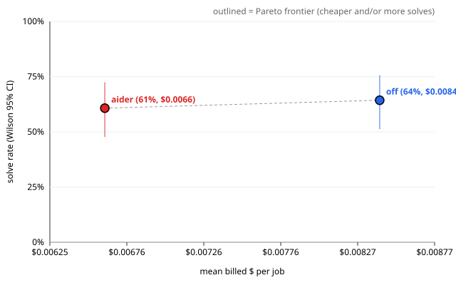

# Evaluation report — real_issues job_series_real_issues_combined_fair

> **Health: UNKNOWN** — no health.json found; run `scripts/eval_health.py` before believing this run (protocol rule 2).

## Run

- results: `.awos/job_series_real_issues_combined_fair.json`
- run id: `job_series_real_issues_combined_fair`
- series: `real_issues` · arms: `off`, `aider`
- model pin: `?`
- jobs: 28 · repeats K = 2 · rows: 112
- dropped (paired exclusion): none

## Per arm

Rows valid in every arm only. Intervals are 95%. With K > 1 the runs of one task are correlated, so the run-level intervals are too narrow; use the paired task-level tests below.

| arm | solved/n | rate | Wilson CI | Clopper-Pearson CI | pass@1 | pass^2 | mean turns | mean $/job | $/solved | solved per $1 | mean min |
| --- | --- | --- | --- | --- | --- | --- | --- | --- | --- | --- | --- |
| `off` | 36/56 | 64.3% | [51.2, 75.5] | [50.4, 76.6] | 64.3% | 53.6% | 10.8 | $0.0084 | $0.0131 | 76.4 | 2.66 |
| `aider` | 34/56 | 60.7% | [47.6, 72.4] | [46.8, 73.5] | 60.7% | 42.9% | 1.1 | $0.0066 | $0.0109 | 91.8 | 2.44 |

$ is reconciled provider billing (`billed_usd`).

## Paired comparisons

Each pair uses the jobs valid in both of its arms. Difference = first − second. K > 1: per-task solve-rate difference; paired sign-flip permutation p and bootstrap CI over tasks (seed 20261002, 10000 resamples).
MDE = minimum detectable difference at 80% power (≈ 2.8·sqrt(var(diff)/n), Miller).

### `off` vs `aider` — 28 tasks, 56 paired runs

- solved: off 36/56 vs aider 34/56 · mean difference 3.6% · bootstrap CI [-14.3, 21.4]
- paired sign-flip permutation (exact): p = 0.8416
- **Not significant at 0.05.** MDE ≈ 24.9%: a true difference smaller than this would usually go undetected with 28 tasks.
- read these transcripts (discordant tasks): j1, j2, j7, j8, j11, j12, j13, j14, j17, j18, j21, j23, j24, j25, j26, j28
- billed $/job difference: $0.0018 · CI [-0.0015, +0.0050] · sign-flip p = 0.2979 (28 tasks)
- turns difference: 9.7 · CI [+6.0, +13.8] · sign-flip p = 1.00e-04 (28 tasks)

## Per job

Cell: verdict (✓ solved, ✗ not, invalid) · hidden passed/total · turns · billed $. Repeats are listed in order.

| job | id | `off` | `aider` |
| --- | --- | --- | --- |
| 1 | `real_boltons_428` | ✓ 45/45 · 1t · $0.0027 ✓ 45/45 · 1t · $0.0000 | ✗ 44/45 · 0t · $0.0000 ✓ 45/45 · 1t · $0.0026 |
| 2 | `real_boltons_458` | ✓ 30/30 · 1t · $0.0033 ✓ 30/30 · 7t · $0.0000 | ✗ 29/30 · 1t · $0.0000 ✓ 30/30 · 1t · $0.0038 |
| 3 | `real_boltons_474` | ✓ 16/16 · 1t · $0.0000 ✓ 16/16 · 1t · $0.0000 | ✓ 16/16 · 1t · $0.0000 ✓ 16/16 · 1t · $0.0000 |
| 4 | `real_cachetools_405` | ✓ 175/175 · 13t · $0.0068 ✗ 168/175 · 29t · $0.0189 | ✓ 175/175 · 4t · $0.0246 ✗ 169/175 · 2t · $0.0217 |
| 5 | `real_cachetools_423` | ✓ 29/29 · 1t · $0.0041 ✓ 29/29 · 11t · $0.0000 | ✓ 29/29 · 3t · $0.0238 ✓ 29/29 · 1t · $0.0108 |
| 6 | `real_jsonpointer_64` | ✓ 26/26 · 1t · $0.0048 ✓ 26/26 · 1t · $0.0000 | ✓ 26/26 · 1t · $0.0000 ✓ 26/26 · 1t · $0.0033 |
| 7 | `real_jsonpointer_70` | ✓ 24/24 · 14t · $0.0046 ✓ 24/24 · 1t · $0.0000 | ✗ 23/24 · 0t · $0.0039 ✓ 24/24 · 1t · $0.0020 |
| 8 | `real_jsonpointer_83` | ✓ 31/31 · 1t · $0.0000 ✓ 31/31 · 8t · $0.0031 | ✓ 31/31 · 1t · $0.0083 ✗ 28/33 · 0t · $0.0076 |
| 9 | `real_more-itertools_1250` | ✓ 597/597 · 1t · $0.0019 ✓ 597/597 · 1t · $0.0000 | ✓ 597/597 · 1t · $0.0000 ✓ 597/597 · 1t · $0.0000 |
| 10 | `real_more-itertools_1284` | ✓ 613/613 · 10t · $0.0065 ✓ 613/613 · 16t · $0.0094 | ✓ 613/613 · 1t · $0.0000 ✓ 613/613 · 1t · $0.0140 |
| 11 | `real_more-itertools_1304` | ✗ 618/619 · 1t · $0.0000 ✗ 618/619 · 1t · $0.0000 | ✓ 619/619 · 1t · $0.0110 ✗ 617/619 · 0t · $0.0000 |
| 12 | `real_parse_137` | ✗ 49/50 · 27t · $0.0183 ✓ 50/50 · 45t · $0.0225 | ✓ 50/50 · 2t · $0.0044 ✗ 49/50 · 0t · $0.0010 |
| 13 | `real_parse_159` | ✗ 49/50 · 27t · $0.0358 ✓ 50/50 · 2t · $0.0016 | ✓ 50/50 · 1t · $0.0000 ✓ 50/50 · 1t · $0.0000 |
| 14 | `real_parse_249` | ✗ 49/50 · 27t · $0.0243 ✗ 49/50 · 1t · $0.0000 | ✓ 50/50 · 2t · $0.0077 ✗ 49/50 · 0t · $0.0011 |
| 15 | `real_pyparsing_332` | ✗ 8/9 · 27t · $0.0172 ✗ 8/9 · 27t · $0.0175 | ✗ 8/9 · 2t · $0.0000 ✗ 1916/1922 · 2t · $0.0113 |
| 16 | `real_pyparsing_560` | ✗ 1932/1934 · 27t · $0.0135 ✗ 1932/1934 · 45t · $0.0383 | ✗ 1932/1934 · 0t · $0.0000 ✗ 1933/1934 · 2t · $0.0329 |
| 17 | `real_pyparsing_647` | ✗ 1850/1856 · 1t · $0.0014 ✓ 1850/1850 · 16t · $0.0106 | ✓ 1850/1850 · 1t · $0.0000 ✓ 1850/1850 · 2t · $0.0099 |
| 18 | `real_sqlparse_332` | ✗ 87/88 · 27t · $0.0182 ✓ 88/88 · 1t · $0.0022 | ✓ 88/88 · 1t · $0.0000 ✓ 88/88 · 1t · $0.0011 |
| 19 | `real_sqlparse_601` | ✗ 91/93 · 28t · $0.0193 ✗ 91/93 · 27t · $0.0181 | ✗ 91/93 · 0t · $0.0099 ✗ 91/93 · 2t · $0.0148 |
| 20 | `real_sqlparse_867` | ✓ 100/100 · 6t · $0.0000 ✓ 100/100 · 1t · $0.0000 | ✓ 100/100 · 1t · $0.0163 ✓ 100/100 · 1t · $0.0000 |
| 21 | `real_tabulate_176` | ✓ 178/178 · 20t · $0.0170 ✗ 177/178 · 2t · $0.0073 | ✓ 178/178 · 1t · $0.0000 ✓ 178/178 · 1t · $0.0031 |
| 22 | `real_tabulate_256` | ✓ 178/178 · 1t · $0.0000 ✓ 178/178 · 1t · $0.0000 | ✓ 178/178 · 1t · $0.0062 ✓ 178/178 · 1t · $0.0000 |
| 23 | `real_tabulate_53` | ✓ 180/180 · 1t · $0.0000 ✓ 180/180 · 1t · $0.0000 | ✗ 179/180 · 1t · $0.0000 ✗ 179/180 · 1t · $0.0000 |
| 24 | `real_tomlkit_542` | ✓ 70/70 · 18t · $0.0088 ✓ 70/70 · 36t · $0.0370 | ✓ 70/70 · 2t · $0.0216 ✗ 69/70 · 2t · $0.0146 |
| 25 | `real_tomlkit_591` | ✓ 73/73 · 17t · $0.0159 ✓ 73/73 · 1t · $0.0226 | ✗ 72/73 · 0t · $0.0160 ✓ 73/73 · 1t · $0.0000 |
| 26 | `real_tomlkit_619` | ✓ 94/94 · 2t · $0.0060 ✓ 94/94 · 17t · $0.0130 | ✗ 92/94 · 0t · $0.0541 ✗ 92/94 · 0t · $0.0033 |
| 27 | `real_toolz_634` | ✗ 38/39 · 1t · $0.0083 ✗ 38/39 · 1t · $0.0048 | ✗ 38/39 · 1t · $0.0000 ✗ 38/39 · 1t · $0.0031 |
| 28 | `real_toolz_635` | ✗ 50/51 · 1t · $0.0000 ✗ 50/51 · 1t · $0.0051 | ✓ 51/51 · 1t · $0.0000 ✓ 51/51 · 1t · $0.0000 |

\* ledger cost (no reconciled billing for that row).

## Failures (valid rows)

Includes valid rows of jobs dropped by paired exclusion.

### `off` — 20 unsolved valid run(s)

- j4 r2 `real_cachetools_405`: `tests/test_hidden_cache.py::CacheTest::test_getsizeof_replace_grow`, `tests/test_hidden_fifo.py::FIFOCacheTest::test_getsizeof_replace_grow`, `tests/test_hidden_lfu.py::LFUCacheTest::test_getsizeof_replace_grow`, `tests/test_hidden_lru.py::LRUCacheTest::test_getsizeof_replace_grow`, `tests/test_hidden_rr.py::RRCacheTest::test_getsizeof_replace_grow`, `tests/test_hidden_tlru.py::TLRUCacheTest::test_getsizeof_replace_grow`, `tests/test_hidden_ttl.py::TTLCacheTest::test_getsizeof_replace_grow`
- j11 r1 `real_more-itertools_1304`: `tests/test_hidden_more.py::IchunkedTests::test_zero_nonempty`
- j11 r2 `real_more-itertools_1304`: `tests/test_hidden_more.py::IchunkedTests::test_zero_nonempty`
- j12 r1 `real_parse_137`: `tests/test_hidden_parse.py::test_numbers`
- j13 r1 `real_parse_159`: `tests/test_hidden_parse.py::test_numbers`
- j14 r1 `real_parse_249`: `tests/test_hidden_parse.py::test_numbers`
- j14 r2 `real_parse_249`: `tests/test_hidden_parse.py::test_numbers`
- j15 r1 `real_pyparsing_332`: (no hidden test failed; visible failing: -)
- j15 r2 `real_pyparsing_332`: (no hidden test failed; visible failing: -)
- j16 r1 `real_pyparsing_560`: `tests/test_hidden_unit.py::Test02_WithoutPackrat::testRepeaterNested`, `tests/test_hidden_unit.py::Test02_WithoutPackrat::testRepeaterReusedParser`
- j16 r2 `real_pyparsing_560`: `tests/test_hidden_unit.py::Test02_WithoutPackrat::testRepeaterNested`, `tests/test_hidden_unit.py::Test02_WithoutPackrat::testRepeaterReusedParser`
- j17 r1 `real_pyparsing_647`: (no hidden test failed; visible failing: -)
- j18 r1 `real_sqlparse_332`: `tests/test_hidden_parse.py::test_get_real_name_multi_part_dotted`
- j19 r1 `real_sqlparse_601`: `tests/test_hidden_regressions.py::test_between_leading_dot_float_issue601[a`
- j19 r2 `real_sqlparse_601`: `tests/test_hidden_regressions.py::test_between_leading_dot_float_issue601[a`
- j21 r2 `real_tabulate_176`: `tests/test_hidden_output.py::test_floatfmt_decimal`
- j27 r1 `real_toolz_634`: `tests/test_hidden_functoolz.py::test_compose_annotations`
- j27 r2 `real_toolz_634`: `tests/test_hidden_functoolz.py::test_compose_annotations`
- j28 r1 `real_toolz_635`: `tests/test_hidden_itertoolz.py::test_interpose_empty`
- j28 r2 `real_toolz_635`: `tests/test_hidden_itertoolz.py::test_interpose_empty`

### `aider` — 22 unsolved valid run(s)

- j1 r1 `real_boltons_428`: `tests/test_hidden_iterutils.py::test_backoff_constant_factor`
- j2 r1 `real_boltons_458`: `tests/test_hidden_dictutils.py::test_addlist_iterator`
- j4 r2 `real_cachetools_405`: `tests/test_hidden_cache.py::CacheTest::test_getsizeof_replace_grow`, `tests/test_hidden_fifo.py::FIFOCacheTest::test_getsizeof_replace_grow`, `tests/test_hidden_lfu.py::LFUCacheTest::test_getsizeof_replace_grow`, `tests/test_hidden_lru.py::LRUCacheTest::test_getsizeof_replace_grow`, `tests/test_hidden_tlru.py::TLRUCacheTest::test_getsizeof_replace_grow`, `tests/test_hidden_ttl.py::TTLCacheTest::test_getsizeof_replace_grow`
- j7 r1 `real_jsonpointer_70`: `tests/test_hidden_jsonpointer.py::WrongInputTests::test_string_not_indexable`
- j8 r2 `real_jsonpointer_83`: `tests/test_hidden_jsonpointer.py::LargeIndexTests::test_resolve_large_index`, `tests/test_hidden_jsonpointer.py::LargeIndexTests::test_resolve_large_index_default`, `tests/test_hidden_jsonpointer.py::LargeIndexTests::test_to_last_large_index`
- j11 r2 `real_more-itertools_1304`: `tests/test_hidden_more.py::IchunkedTests::test_negative`, `tests/test_hidden_more.py::IchunkedTests::test_zero_nonempty`
- j12 r2 `real_parse_137`: `tests/test_hidden_parse.py::test_numbers`
- j14 r2 `real_parse_249`: `tests/test_hidden_parse.py::test_numbers`
- j15 r1 `real_pyparsing_332`: (no hidden test failed; visible failing: -)
- j15 r2 `real_pyparsing_332`: `tests/test_hidden_unit.py::Test02_WithoutPackrat::testZeroOrMoreMax`, `tests/test_hidden_unit.py::Test04_WithPackrat::testZeroOrMoreMax`, `tests/test_hidden_unit.py::Test06_WithBoundedPackrat::testZeroOrMoreMax`, `tests/test_hidden_unit.py::Test08_WithUnboundedPackrat::testZeroOrMoreMax`, `tests/test_hidden_unit.py::Test09_WithLeftRecursionParsing::testZeroOrMoreMax`, `tests/test_hidden_unit.py::Test10_WithLeftRecursionParsingBoundedMemo::testZeroOrMoreMax`
- j16 r1 `real_pyparsing_560`: `tests/test_hidden_unit.py::Test02_WithoutPackrat::testRepeaterNested`, `tests/test_hidden_unit.py::Test02_WithoutPackrat::testRepeaterReusedParser`
- j16 r2 `real_pyparsing_560`: `tests/test_hidden_unit.py::Test02_WithoutPackrat::testRepeaterNested`
- j19 r1 `real_sqlparse_601`: `tests/test_hidden_regressions.py::test_between_leading_dot_float_issue601[a`
- j19 r2 `real_sqlparse_601`: `tests/test_hidden_regressions.py::test_between_leading_dot_float_issue601[a`
- j23 r1 `real_tabulate_53`: `tests/test_hidden_output.py::test_simple_headerless_with_sep_line_with_padding_in_tablefmt`
- j23 r2 `real_tabulate_53`: `tests/test_hidden_output.py::test_simple_headerless_with_sep_line_with_padding_in_tablefmt`
- j24 r2 `real_tomlkit_542`: `tests/test_hidden_toml_document.py::test_replace_dotted_key_with_aot_keeps_following_sibling`
- j25 r1 `real_tomlkit_591`: `tests/test_hidden_toml_document.py::test_unwrap_keeps_key_order_after_replacing_a_value`
- j26 r1 `real_tomlkit_619`: `tests/test_hidden_items.py::test_times_behave_like_times_fold`, `tests/test_hidden_items.py::test_datetimes_behave_like_datetimes_fold`
- j26 r2 `real_tomlkit_619`: `tests/test_hidden_items.py::test_times_behave_like_times_fold`, `tests/test_hidden_items.py::test_datetimes_behave_like_datetimes_fold`
- j27 r1 `real_toolz_634`: `tests/test_hidden_functoolz.py::test_compose_annotations`
- j27 r2 `real_toolz_634`: `tests/test_hidden_functoolz.py::test_compose_annotations`

### Failing hidden tests across arms

| test | `off` | `aider` | total |
| --- | --- | --- | --- |
| `tests/test_hidden_parse.py::test_numbers` | 4 | 2 | 6 |
| `tests/test_hidden_functoolz.py::test_compose_annotations` | 2 | 2 | 4 |
| `tests/test_hidden_regressions.py::test_between_leading_dot_float_issue601[a` | 2 | 2 | 4 |
| `tests/test_hidden_unit.py::Test02_WithoutPackrat::testRepeaterNested` | 2 | 2 | 4 |
| `tests/test_hidden_more.py::IchunkedTests::test_zero_nonempty` | 2 | 1 | 3 |
| `tests/test_hidden_unit.py::Test02_WithoutPackrat::testRepeaterReusedParser` | 2 | 1 | 3 |
| `tests/test_hidden_cache.py::CacheTest::test_getsizeof_replace_grow` | 1 | 1 | 2 |
| `tests/test_hidden_fifo.py::FIFOCacheTest::test_getsizeof_replace_grow` | 1 | 1 | 2 |
| `tests/test_hidden_items.py::test_datetimes_behave_like_datetimes_fold` | 0 | 2 | 2 |
| `tests/test_hidden_items.py::test_times_behave_like_times_fold` | 0 | 2 | 2 |
| `tests/test_hidden_itertoolz.py::test_interpose_empty` | 2 | 0 | 2 |
| `tests/test_hidden_lfu.py::LFUCacheTest::test_getsizeof_replace_grow` | 1 | 1 | 2 |
| `tests/test_hidden_lru.py::LRUCacheTest::test_getsizeof_replace_grow` | 1 | 1 | 2 |
| `tests/test_hidden_output.py::test_simple_headerless_with_sep_line_with_padding_in_tablefmt` | 0 | 2 | 2 |
| `tests/test_hidden_tlru.py::TLRUCacheTest::test_getsizeof_replace_grow` | 1 | 1 | 2 |
| `tests/test_hidden_ttl.py::TTLCacheTest::test_getsizeof_replace_grow` | 1 | 1 | 2 |
| `tests/test_hidden_dictutils.py::test_addlist_iterator` | 0 | 1 | 1 |
| `tests/test_hidden_iterutils.py::test_backoff_constant_factor` | 0 | 1 | 1 |
| `tests/test_hidden_jsonpointer.py::LargeIndexTests::test_resolve_large_index` | 0 | 1 | 1 |
| `tests/test_hidden_jsonpointer.py::LargeIndexTests::test_resolve_large_index_default` | 0 | 1 | 1 |
| `tests/test_hidden_jsonpointer.py::LargeIndexTests::test_to_last_large_index` | 0 | 1 | 1 |
| `tests/test_hidden_jsonpointer.py::WrongInputTests::test_string_not_indexable` | 0 | 1 | 1 |
| `tests/test_hidden_more.py::IchunkedTests::test_negative` | 0 | 1 | 1 |
| `tests/test_hidden_output.py::test_floatfmt_decimal` | 1 | 0 | 1 |
| `tests/test_hidden_parse.py::test_get_real_name_multi_part_dotted` | 1 | 0 | 1 |
| `tests/test_hidden_rr.py::RRCacheTest::test_getsizeof_replace_grow` | 1 | 0 | 1 |
| `tests/test_hidden_toml_document.py::test_replace_dotted_key_with_aot_keeps_following_sibling` | 0 | 1 | 1 |
| `tests/test_hidden_toml_document.py::test_unwrap_keeps_key_order_after_replacing_a_value` | 0 | 1 | 1 |
| `tests/test_hidden_unit.py::Test02_WithoutPackrat::testZeroOrMoreMax` | 0 | 1 | 1 |
| `tests/test_hidden_unit.py::Test04_WithPackrat::testZeroOrMoreMax` | 0 | 1 | 1 |
| `tests/test_hidden_unit.py::Test06_WithBoundedPackrat::testZeroOrMoreMax` | 0 | 1 | 1 |
| `tests/test_hidden_unit.py::Test08_WithUnboundedPackrat::testZeroOrMoreMax` | 0 | 1 | 1 |
| `tests/test_hidden_unit.py::Test09_WithLeftRecursionParsing::testZeroOrMoreMax` | 0 | 1 | 1 |
| `tests/test_hidden_unit.py::Test10_WithLeftRecursionParsingBoundedMemo::testZeroOrMoreMax` | 0 | 1 | 1 |

## Pareto: solve rate vs $

| arm | mean $/job | solve rate |
| --- | --- | --- |
| `off` | $0.0084 | 64.3% |
| `aider` | $0.0066 | 60.7% |

Protocol rule 9: compare against a simple retry baseline at the same budget before claiming a cost win.
