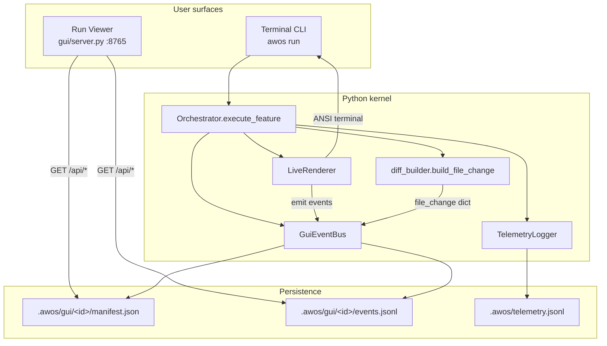

# AWOS GUI Layer — Canonical Specification & Memory

> **This is the single source of truth for all GUI-related architecture, schemas, and decisions.**
> Other docs must link here — do not duplicate GUI facts elsewhere.
>
> **Immutable session record:** [[checkpoint_gui_layer_2026-06-12]]
> **Related:** [[SESSION_MEMORY_GUIDE]], [[checkpoint_2026-06-12]], `protocols/MEMORY_PROTOCOL.md`

---

## 1. Why this exists

### User intent (2026-06-12 conversation)

AWOS cannot remain CLI-only. Agencies and non-terminal users need a visual surface to:

1. **See diffs properly** — not truncated terminal boxes; full hunks with line numbers, green/red, scrollable.
2. **See files changed/created** — a file tree with status badges (`created`, `modified`, `deleted`), per-file stats.
3. **Log improvement stats in the backend** — rich telemetry for agent tuning that is **never shown on the main GUI** (keeps UI clean; feeds learning loops).

### Strategic context

| Constraint | Source | Implication |
|---|---|---|
| Minimize dependencies for v0 GUI | `VISION.md` Layer 0 (runtime first) | v0 GUI uses **stdlib `http.server`** — zero new deps |
| Checkpoint lists FastAPI as future work | `docs/memory/checkpoint_2026-06-12.md` | Phase 2+ can add FastAPI + SSE when GTM allows |
| Do not build on `src/` | Exploration 2026-06-12 | `src/` is vendored Claude Code — unrelated to AWOS |
| Wrap Python, don't duplicate | Architecture principle | GUI reads `.awos/gui/` + calls existing orchestrator |

---

## 2. Design principles

| Principle | Decision |
|---|---|
| **Dual output** | Terminal (`LiveRenderer`) unchanged for devs; parallel structured events for GUI |
| **Separate concerns** | GUI events (user-visible) ≠ telemetry (improvement-only) |
| **Append-only** | `events.jsonl`, `telemetry.jsonl` — never edit in place |
| **Session = orchestrator run** | GUI session ID = `ReasoningSession.session_id` (e.g. `orch_09d154cb`) |
| **Diff at verify time** | Structured diff built when verifier applies change — same moment as `print_visual_diff` |
| **Full hunks in manifest** | GUI manifest stores complete `hunks[]` + `unified_diff` — not truncated like terminal (16 lines) |

---

## 3. Architecture overview



### Three data channels

| Channel | Path | Audience | Contents |
|---|---|---|---|
| **GUI manifest** | `.awos/gui/<session_id>/manifest.json` | Run Viewer | Goal, status, files[], summary, cost |
| **GUI events** | `.awos/gui/<session_id>/events.jsonl` | Live UI (future SSE) | Typed event stream |
| **Telemetry** | `.awos/telemetry.jsonl` | Agent improvement only | Models, tokens, timing, failures, rewards |

**Critical:** Telemetry is intentionally **not** rendered in `gui/static/`. It exists for offline analysis, PromptEvolver, failure mining, PEI tuning.

---

## 4. File map (complete)

### New Python modules

| File | Lines (approx) | Role |
|---|---|---|
| `scaffold/agent/diff_builder.py` | ~265 | Structured diffs from search/replace or git |
| `scaffold/agent/gui_events.py` | ~187 | `GuiEventBus`, manifest + events persistence |
| `scaffold/agent/telemetry_log.py` | ~128 | `TaskTelemetry`, `SessionTelemetry`, JSONL logger |

### Modified Python modules

| File | Change |
|---|---|
| `scaffold/agent/live_renderer.py` | Optional `event_bus` param; `_emit()` on every public method |
| `scaffold/agent/run_diagnostics.py` | `print_visual_diff()` returns structured dict; shows status badge in terminal |
| `scaffold/agent/orchestrator.py` | Creates `GuiEventBus` + `TelemetryLogger` per run; wires into `_ctx`; logs on task/session end |

### GUI application

| File | Role |
|---|---|
| `gui/server.py` | Stdlib HTTP server + JSON API |
| `gui/static/index.html` | Run Viewer shell (sidebar + file list + diff panel) |
| `gui/static/app.js` | Fetches API, renders diffs with line numbers |
| `gui/static/style.css` | Dark theme; green add / red remove |

### Tests

| File | Coverage |
|---|---|
| `tests/test_diff_builder.py` | Hunk parsing, created/modified detection, session aggregation |

### Runtime data (gitignored)

| Path | Created by |
|---|---|
| `.awos/gui/<session_id>/manifest.json` | `GuiEventBus` |
| `.awos/gui/<session_id>/events.jsonl` | `GuiEventBus.emit()` |
| `.awos/telemetry.jsonl` | `TelemetryLogger` |

---

## 5. Orchestrator integration (exact wiring)

### Session start (`execute_feature`)

```python
session = ReasoningSession(session_id=f"orch_{uuid.uuid4().hex[:8]}", goal=goal)

_gui = GuiEventBus(session.session_id, goal=goal)
_telemetry = TelemetryLogger()
_live = LiveRenderer(event_bus=_gui)
_live.session_start(goal, n_files=...)
```

### Task context (`_ctx` dict)

```python
_ctx = dict(
    codebase_root=...,
    session=session,
    _live=_live,
    _gui=_gui,           # NEW
    _telemetry=_telemetry,  # NEW
    _run_diag=self._run_diag,
    ...
)
```

### On verify success (per task)

```python
_change_dict = print_visual_diff(file, search, replace, codebase_root=...)
if _change_dict and _gui:
    _gui.record_file_change(_change_dict)
```

`record_file_change`:
1. Appends to in-memory `_file_changes`
2. Emits `file_change` event to `events.jsonl`
3. Updates `manifest.json` → `files[]` (full hunks) + `summary`

### On task complete (all paths)

`TaskTelemetry` logged to `.awos/telemetry.jsonl` — includes:
- Worker failures (early return path)
- Verify success/failure path (full stats)

### On session complete

```python
_gui.session_done(completed=..., failed=..., total_cost=..., elapsed=...)
_telemetry.log_session(SessionTelemetry(...))
```

---

## 6. Schema reference

### 6.1 `manifest.json`

```json
{
  "session_id": "orch_09d154cb",
  "goal": "add docstring to usage_record.py",
  "status": "running | completed | partial",
  "started_at": "2026-06-12T10:00:00Z",
  "completed_at": "2026-06-12T10:01:30Z",
  "tasks_completed": 1,
  "tasks_failed": 0,
  "total_cost_usd": 0.001,
  "elapsed_sec": 19.2,
  "files": [ /* FileChange[] — see 6.2 */ ],
  "summary": {
    "total_files": 1,
    "created": 0,
    "modified": 1,
    "deleted": 0,
    "lines_added": 3,
    "lines_removed": 0
  }
}
```

### 6.2 `FileChange` (in `manifest.files[]` and `file_change` events)

```json
{
  "path": "scaffold/agent/worker.py",
  "status": "modified",
  "lines_added": 1,
  "lines_removed": 0,
  "hunks": [
    {
      "old_start": 42,
      "old_count": 3,
      "new_start": 42,
      "new_count": 4,
      "lines": [
        { "type": "header", "content": "@@ -42,3 +42,4 @@", "old_line_no": null, "new_line_no": null },
        { "type": "context", "content": "    def _try_cheap_fallback(", "old_line_no": 42, "new_line_no": 42 },
        { "type": "add", "content": "    # Tries alternate cheap providers.", "old_line_no": null, "new_line_no": 43 },
        { "type": "context", "content": "        self, ...", "old_line_no": 43, "new_line_no": 44 }
      ]
    }
  ],
  "unified_diff": "--- scaffold/agent/worker.py (before)\n+++ ...",
  "before_excerpt": "...(max 2000 chars of search block)",
  "after_excerpt": "...(max 2000 chars of replace block)"
}
```

**`status` values:** `created` | `modified` | `deleted` | `renamed`

**Detection logic (`diff_builder._detect_status`):**
- File doesn't exist on disk + has `replace` → `created`
- File exists + empty `replace` + non-empty `search` → `deleted`
- Else → `modified`
- Git porcelain (`git status --porcelain`) can override when available

### 6.3 `events.jsonl` (one JSON object per line)

```json
{
  "type": "session_start | planning_done | task_start | tool_event | worker_start | worker_done | verify_result | file_change | task_done | retry_notice | session_done",
  "session_id": "orch_09d154cb",
  "timestamp": "2026-06-12T10:00:01Z",
  "payload": { }
}
```

#### Event catalog

| `type` | Emitted by | Key `payload` fields |
|---|---|---|
| `session_start` | `LiveRenderer.session_start` | `goal`, `n_files` |
| `planning_done` | `LiveRenderer.planning_done` | `task_count`, `model`, `tasks[]` |
| `task_start` | `LiveRenderer.task_start` | `idx`, `total`, `task_id`, `action`, `file`, `model` |
| `tool_event` | `LiveRenderer.tool_event` | `tool`, `detail`, `success` |
| `worker_start` | `LiveRenderer.worker_start` | `attempt`, `model`, `temperature` |
| `worker_done` | `LiveRenderer.worker_done` | `success`, `tokens`, `cost`, `n_edits`, `error` |
| `verify_result` | `LiveRenderer.verify_result` | `passed`, `issues[]` |
| `file_change` | `GuiEventBus.record_file_change` | Full `FileChange` dict |
| `task_done` | `LiveRenderer.task_done` | `success`, `elapsed` |
| `retry_notice` | `LiveRenderer.retry_notice` | `attempt`, `reason`, `correction` |
| `session_done` | `GuiEventBus.session_done` | `completed`, `failed`, `total_cost`, `files_summary` |

### 6.4 `telemetry.jsonl` — task record

```json
{
  "event": "task_complete",
  "session_id": "orch_09d154cb",
  "task_id": "1",
  "timestamp": "2026-06-12T10:00:45Z",
  "goal": "...",
  "action": "...",
  "file": "scaffold/agent/worker.py",
  "success": true,
  "model": "deepseek-chat",
  "strategy": "direct_patch",
  "escalation_level": 2,
  "attempt_count": 1,
  "retry_count": 0,
  "input_tokens": 1200,
  "output_tokens": 340,
  "cached_tokens": 0,
  "cost_usd": 0.0009,
  "verify_passed": true,
  "verify_attempts": 1,
  "fidelity_fail": false,
  "edits_applied": 1,
  "edits_failed": 0,
  "edit_status": "ok",
  "lines_added": 1,
  "lines_removed": 0,
  "file_status": "modified",
  "queue_wait_ms": 12.5,
  "worker_latency_ms": 4800.0,
  "total_latency_ms": 5200.0,
  "tests_passed": 0,
  "tests_failed": 0,
  "test_pass_rate": 0.0,
  "no_tests_found": true,
  "failure_stage": "",
  "failure_reason": "",
  "reward": 0.85,
  "span_id": "a1b2c3d4e5f6",
  "stages": [
    { "stage": "route", "model": "deepseek-chat", "ok": true },
    { "stage": "worker", "model": "deepseek-chat", "ok": true, "tokens": 1540 },
    { "stage": "verify", "ok": true, "detail": "applied" }
  ]
}
```

### 6.5 `telemetry.jsonl` — session record

```json
{
  "event": "session_complete",
  "session_id": "orch_09d154cb",
  "timestamp": "2026-06-12T10:01:30Z",
  "goal": "...",
  "tasks_completed": 1,
  "tasks_failed": 0,
  "total_cost_usd": 0.0009,
  "elapsed_sec": 19.2,
  "files_touched": 1,
  "lines_added": 1,
  "lines_removed": 0,
  "cheap_only": true
}
```

---

## 7. HTTP API (`gui/server.py`)

| Method | Path | Response |
|---|---|---|
| GET | `/` | `index.html` (Run Viewer) |
| GET | `/style.css`, `/app.js` | Static assets |
| GET | `/api/sessions` | Array of all `manifest.json` objects, newest first |
| GET | `/api/sessions/<id>` | Single manifest |
| GET | `/api/sessions/<id>/events` | Full `events.jsonl` as JSON array |
| GET | `/api/sessions/<id>/files` | `{ files: [...], summary: {...} }` |

**Default bind:** `127.0.0.1:8765`

```bash
python3 gui/server.py
python3 gui/server.py --port 9000 --host 0.0.0.0
```

**Chat API (2026-06-12):**
- `GET /api/modes` — Q/A, Plan, Agent mode list
- `GET /api/chat/sessions` — chat history
- `POST /api/chat` — `{message, mode, chat_id?}` → structured reply

**Not yet implemented:**
- WebSocket / SSE live stream during agent run
- SSE tailing `events.jsonl` during active run

---

## 8. Run Viewer UI layout

```
┌─────────────────────────────────────────────────────────────────┐
│  AWOS Run Viewer                                                │
├──────────────┬──────────────────────────────────────────────────┤
│  Runs        │  Goal header + summary bar                       │
│  (sidebar)   │  (tasks, created/modified, +/-, cost)              │
│              ├──────────────┬───────────────────────────────────┤
│  orch_abc    │  Files       │  Diff panel                       │
│  orch_def    │  [created]   │  line numbers | green + | red -   │
│              │  foo.py      │  full hunks, scrollable             │
│              │  [modified]  │                                   │
│              │  bar.py      │                                   │
└──────────────┴──────────────┴───────────────────────────────────┘
```

**URL deep link:** `http://127.0.0.1:8765/?session=orch_09d154cb`

---

## 9. Relationship to other AWOS memory layers

| Layer | Overlap with GUI | Distinction |
|---|---|---|
| **Chat session memory** (`.awos/sessions/*.json`) | None currently | Chat REPL only; GUI targets `awos run` orchestrator |
| **Reasoning traces** (`.awos/traces/*.json`) | Same `session_id` prefix `orch_*` | Traces = ReAct thoughts; GUI events = UX stream |
| **Spans** (`.awos/spans.jsonl`) | Telemetry duplicates some span fields | Spans = PEI metrics; telemetry = richer improvement record |
| **Reward store** (`.awos/reward_store.jsonl`) | Telemetry includes `reward` field | Reward store = ML router training; telemetry = superset for analysis |
| **Checkpoints** (`docs/memory/`) | This spec is the GUI canonical owner | Checkpoints are immutable session history |

---

## 10. Planned phases (not yet built)

### Phase 0 — DONE (2026-06-12)
- Structured diffs + file manifest
- Backend telemetry
- Run Viewer (read-only, post-run)
- `LiveRenderer` → event bus dual output

### Phase 1 — Live streaming
- SSE or WebSocket tailing `events.jsonl` during active run
- Progress bar / task list updates without refresh
- `GuiEventBus.subscribe()` already supports in-process callbacks

### Phase 2 — Interactive run + chat (PARTIAL 2026-06-12)
- ✅ Chat panel with mode picker: **Q/A** | **Plan** | **Agent**
- ✅ `POST /api/chat` → `gui_chat.py` (qa=prose, plan=CheapPlanner, agent=Orchestrator)
- ✅ Chat sessions in `.awos/gui_chat/`
- ⬜ WebSocket/SSE live progress during agent runs

### Phase 3 — Internal telemetry dashboard (separate route)
- `/admin/telemetry` — reads `.awos/telemetry.jsonl`
- **Not** on main user-facing Run Viewer
- Failure histograms, model comparison, fidelity fail rate

### Phase 4 — Desktop shell (optional)
- Tauri/Electron wrapping `gui/static`
- Native file open from diff panel

---

## 11. What we explicitly did NOT do

| Rejected | Reason |
|---|---|
| Fork `src/` (Claude Code) | Unrelated; 1900+ TS files, zero AWOS wiring |
| Rebuild orchestrator in JS | Duplicate logic; wrap Python instead |
| Show telemetry on main GUI | User requirement: backend only for improvement |
| FastAPI in v0 | GTM constraint; stdlib server sufficient for demos |
| Truncate diffs in manifest | Terminal truncates at 16 lines; GUI gets full hunks |
| Single monolithic "memory" blob | Split: GUI events (visible) vs telemetry (hidden) |

---

## 12. Developer workflow

### Produce GUI data

```bash
# From repo root — creates .awos/gui/orch_<hex>/ and .awos/telemetry.jsonl entries
python3 awos.py run "In scaffold/agent/usage_record.py add a module docstring"
```

### View in browser

```bash
python3 gui/server.py
# Open http://127.0.0.1:8765
```

### Inspect telemetry (improvement analysis)

```bash
tail -f .awos/telemetry.jsonl | python3 -m json.tool
# Or jq:
jq -s 'group_by(.failure_stage) | map({stage: .[0].failure_stage, count: length})' .awos/telemetry.jsonl
```

### Run tests

```bash
python3 -m pytest tests/test_diff_builder.py -q
```

---

## 13. Cold-start for next agent working on GUI

**Read in order:**

1. **This file** — `docs/specs/gui_layer_spec.md`
2. `gui/server.py` + `gui/static/app.js` — current UI
3. `scaffold/agent/gui_events.py` — event persistence
4. `scaffold/agent/diff_builder.py` — diff structure
5. `scaffold/agent/telemetry_log.py` — backend stats schema
6. `scaffold/agent/orchestrator.py` — search `_gui`, `_telemetry`, `record_file_change`

**Do not read for GUI work:** `src/` (Claude Code vendor tree)

---

## 14. Open questions / known gaps

| Gap | Impact | Suggested fix |
|---|---|---|
| No live SSE during run | User must refresh after run completes | Phase 1: tail `events.jsonl` in server |
| Chat not in GUI | Only orchestrator runs visible | Phase 2: UnifiedAgent HTTP wrapper |
| `renamed` status unused | No rename detection yet | Add in `diff_builder` when git detects rename |
| GUI server is read-only | Can't start runs from browser | Phase 2 POST endpoint |
| Telemetry has no query API | Manual `jq` on jsonl | Phase 3 admin dashboard |
| `orch_*` session ID not returned in `awos run` stdout | User must find in `.awos/gui/` | Add `session_id` to final summary print |

---

## 15. Version history

| Date | Change |
|---|---|
| 2026-06-12 | Initial GUI layer: diff_builder, gui_events, telemetry_log, Run Viewer, orchestrator wiring |

---

**Canonical owner:** `docs/specs/gui_layer_spec.md`
**Do not duplicate GUI schemas or file paths in other docs — link here.**
